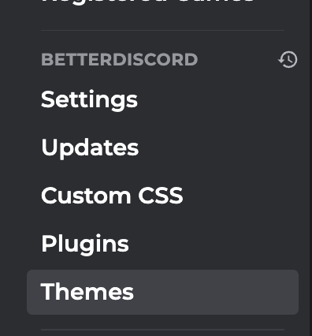

# **This is a BetterDiscord theme ngSiren**

**_Scheme colors:_**

- <span style="color: #ffdb93">[Yellow](https://github.com/fasunareuu/ngSiren-discord/blob/master/color%20shceme/ngSiren%20yellow.theme.css 'Yellow scheme') color scheme

- <span style="color: #ff9393"> [Red](https://github.com/fasunareuu/ngSiren-discord/blob/master/color%20shceme/ngSiren%20red.theme.css 'Red scheme') color scheme

- <span style="color: #93b9ff">[Blue](https://github.com/fasunareuu/ngSiren-discord/blob/master/color%20shceme/ngSiren%20blue.theme.css 'Blue scheme') color scheme

- <span style="color: #ff93e4">[Pink](https://github.com/fasunareuu/ngSiren-discord/blob/master/color%20shceme/ngSiren%20pink.theme.css 'Pink scheme') color scheme

- <span style="color: #93ffed">[Mint](https://github.com/fasunareuu/ngSiren-discord/blob/master/color%20shceme/ngSiren%20mint.theme.css 'Mint scheme') color scheme

- <span style="color: #ffdb93">[Orange](https://github.com/fasunareuu/ngSiren-discord/blob/master/color%20shceme/ngSiren%20orange.theme.css 'Orange scheme') color scheme

#

**How to install?**

```github
git clone https://github.com/fasunareuu/ngSiren-discord.git
```

**Clone this to desktop, and move to folder BetterDiscord theme your color scheme**

**_Example: "ngSiren blue.theme.css_"**

<div align="left">
    
</div>

#

<div align="left">
    
</div>

**_And move to this folder your color scheme file_**
